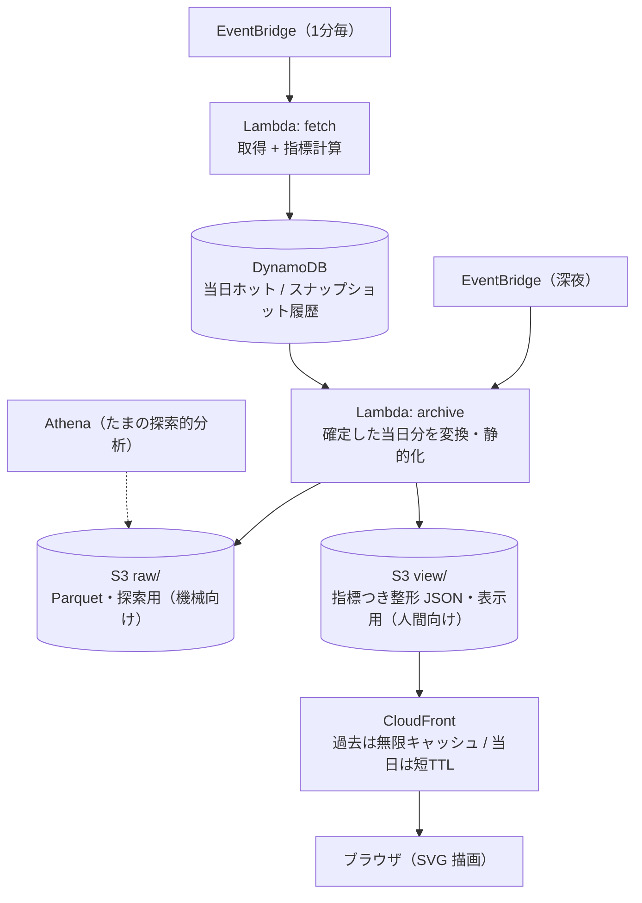
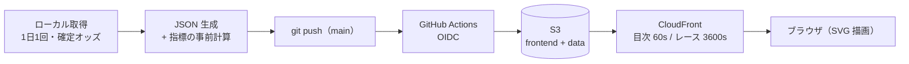

# OddsResolver

競馬オッズを「数字の羅列」から「動きと歪みの地図」へ解きほぐす可視化サイト。

**デモ**: https://dpfh12i0smzxl.cloudfront.net/ （地方競馬の実データで稼働中）

現在オッズをそのまま並べるのではなく、**時間 × 馬 × 濃淡**でオッズがどう動いたかを一目で読ませ、
オッズの歪み（過剰人気・過小評価）や過熱度（急変）を色と形で可視化することを狙う。

> "resolve" = ごちゃついた数字を、意味のある視覚像に解きほぐす。

## コンセプト

- 主役は**可視化**。リアルタイム基盤は器にすぎない。
- 見せるのは現在値の羅列ではなく、**「変化」と「歪み」**。ここに価値を置く。
- 「何を色にするか」の指標設計が主戦場。チャートの種類はその次。

### 可視化の候補

| 見せたい意味 | 色にする量 | 形 |
| --- | --- | --- |
| 人気の分布 | 支持率（= 1/オッズ を正規化） | ツリーマップ / バブル |
| 歪み・妙味 | 支持率と実力の乖離 | 発散配色（青↔白↔赤） |
| 過熱・急変 | 直近の変化率 / 時間微分 | 馬 × 時間ヒートマップ |
| 確度 | オッズの安定 / ブレ | スパークライン |

“顔”になる一枚は **馬 × 時間のヒートマップ**（縦=馬、横=時刻、色=支持率 or 変化）を想定。

## 設計思想

このプロジェクトの骨格は、次の性質から導かれる。

- **append-only**：「ある時刻に、ある馬のオッズはいくつだった」という事実を積むだけ。
  一度確定した過去は二度と変わらない。update / delete は原理的に発生しない。
- **確定した過去は静的化できる**：過去レースの表示結果は一度作れば永久に同じ。
  ならばアクセスの都度組み立てる必要はなく、**完成品を静的ファイルへ焼き付けて返すだけ**でよい。
- **データはテキストのみ**：画像を持たないため軽く、圧縮がよく効く。容量はまず問題にならない。

結果として、**動的なのは「当日の生きているレース」だけ**。それ以外は全て静的ファイルへ畳む。

## 「指標計算」と「探索的分析」を区別する

「分析」という語は二つの別物を指すため、本プロジェクトでは用語を分ける。

- **指標計算**：生オッズを、可視化が色にできる量へ変換する処理。**毎分の決定的な差分計算**。
  生オッズ（`3番 = 4.8 倍`）は桁が開きすぎて色に潰れるため、そのままでは可視化できない。
  append-only で積んだ事実の差分を取り、次の量を出す。

  | 出す量 | 計算 | どう色になるか |
  | --- | --- | --- |
  | 支持率 | `1/オッズ` を全馬で正規化（合計 100%） | 連続配色の元 |
  | 変化率 / 過熱度 | 前回スナップショットとの差・時間微分 | ヒートマップの濃淡 |
  | 歪みスコア | 支持率と本来の実力の乖離 | 発散配色（過剰人気=赤／過小評価=青） |
  | 急変フラグ | 一定以上の変化を検出 | 直前で急落した馬のハイライト |

- **探索的分析**：S3 `raw/` を Athena で後から掘る、**たまに・重い**クエリ（例「先月の急変レース一覧」）。
  指標計算とは別物。サイト表示の経路には出さない。

## アーキテクチャ（想定 / AWS 無料枠前提）

- **当日（ホット）**：取得 Lambda が生オッズを取り、指標計算して DynamoDB へ。提示は 1 分キャッシュ。
- **夜間バッチ**：確定分を読み、`raw/`（Parquet, 探索用）と `view/`（指標つき JSON, 表示用）へ書き出す。
  移送済みの当日データは DynamoDB の TTL で自動失効させ、削除処理を書かない。
- **過去表示**：CloudFront → S3 の静的ファイルを返すだけ。**API 無し・DB 無し・サーバー無し**。
- **深い分析**：必要な時だけ Athena が S3 `raw/` に直接 SQL（常駐ゼロ・使った分だけ）。

### 取得のネットワーク方針

取得は **VPC 外の Lambda のデフォルト構成**とし、送信元 IP が実行ごとに **AWS 共有プールから可変**である
性質を利点として活かす。

- **利点**：IP 単位のブロックやレート制限を自然に回避できる。かつ NAT Gateway（固定 IP 用・無料枠外で
  月数十ドル規模）の固定費を払わずに済む。
- **限界**：可変 IP でも全て AWS 帯なので、相手が**クラウド帯ごと拒否**する場合は無力。その場合のみ
  固定 IP（VPC + NAT Gateway）や取得経路の分離を別途検討する。

### サーバーとブラウザの責務境界

**Lambda は「数字を作る」まで、ブラウザは「数字を絵にする」。** 描画はサーバーでは行わない。

|  | 取得 | 指標計算 | 整形 (view) | 描画 (絵) |
| --- | --- | --- | --- | --- |
| 当日 | Lambda | Lambda | ― | ブラウザ |
| 夜間 | ― | (確定値) | Lambda | ― |
| 過去表示 | ― | ― | (焼済み) | ブラウザ |

- **`view/` は「指標計算まで済んだ整形 JSON」**であって、絵（SVG / HTML）ではない。
  ブラウザが view の数値を色・座標へ写して SVG で描く。
- **絵まで焼かない**理由：配色やチャートを後から変えても再生成が要らず、フロントの JS だけ直せばよい。
  絵まで焼くと、見た目を一つ変えるたび全過去レースの再焼きになる。
- **描画は SVG ベース**を想定（馬 × 時間ヒートマップや発散配色に最適で、テキストゆえ容量も軽い）。
  実装時は配色・mark 設計を `dataviz` の方針に沿って詰める。

### 主要な設計判断とその理由

| 判断 | 理由 |
| --- | --- |
| ユーザー提示は 1 分毎 | WebSocket / 常時接続が不要になり、無料枠に素直に収まる |
| 取得は内部的に 1 分（後で締切直前だけ短縮可能） | EventBridge 最短 1 分と噛み合う。時間帯可変は後付けできる |
| 過去は静的ファイルに焼く | append-only。落ちるサーバーが無く、CDN が何万アクセスでも捌く |
| アーカイブは RDS ではなく S3 + Athena | 「たまに分析」に常駐 RDBMS は過剰。使った分だけの Athena で狙いは足りる |
| 表示用 `view/` と探索用 `raw/` を分離 | 見た目の改善（配色・チャート）を身軽に、探索的分析は列指向で効率よく |
| 描画はブラウザ、Lambda は指標計算まで | サーバーで絵を作らない。見た目の変更をフロントの JS デプロイだけで完結させる |
| 取得は VPC 外 Lambda（送信元 IP 可変） | IP 単位のブロック/レート制限を自然に回避し、NAT Gateway の固定費を避ける |

## リアルタイム性の到達点

| 構成 | 総遅延 | 追加コスト |
| --- | --- | --- |
| 現構成（提示 1 分） | 最悪 60 秒 | 0 |
| CloudFront TTL を短縮 | 約 10 秒 | ほぼ 0 |
| 取得だけ Fargate 常駐 | 1〜3 秒 | 月数百円 |
| ソースが push + 常駐受信 + WebSocket | < 1 秒 | 月千円〜 |

当面は **1 分**で据える。無理なく・安く・壊れにくい形に最も素直に収まる点がちょうど 1 分。
競馬オッズが激しく動くのは締切直前の数分なので、必要になればそこだけ短縮する（土台はそのまま）。

## 容量の見積り

- 1 レース ≒ 18 頭 × 60 時点（1 分粒度）× 数十バイト ≒ 圧縮後 20〜50KB。
- S3 無料枠 5GB ≒ **5 万〜25 万レース ≒ 十数年〜数十年分**。テキストのみゆえ容量はまず問題にならない。
- 容量が効くのはチャート画像を焼いたときだけ。可視化は SVG / ブラウザ描画に寄せ、画像を S3 に積まない。

## 現在地とロードマップ

### できていること（2026-07-25 時点）

- **配信基盤**: S3 + CloudFront + OIDC デプロイ。目次類は max-age=60 / 確定レースは長期キャッシュに分離。
- **実データ**: 地方競馬 2 日分（2026-07-23: 4 会場 48R / 07-24: 3 会場 36R）。確定オッズ 1 スナップショット。
- **データ配置**: `data/days.json`（開催日の目次）+ `data/{YYYYMMDD}/index.json`（日別一覧 + 事前計算指標）
  + `data/races/{race_id}.json`（レース詳細。全日フラット）。
- **指標の事前計算**: 日別 index に `top1`（1番人気支持率）と `ent`（混戦度 = 正規化エントロピー）を焼き込み。
  閾値と色の判断はフロント側（view は数値まで、の責務境界どおり）。
- **TOP**: 会場タブ（下線式）・日付切り替え（URL は `#日付/会場`）・歪みハイライト（本命一強 × 大混戦の
  対比カード + 支持率バー）・一強/混戦バッジ。
- **詳細ページ**: 支持率ヒートマップ（馬 × 時刻）。データ表ビューつき。
- **デザイン**: テーマは「ナイター紺」（瑠璃紺 + 発散配色 hot/cool）。配色はライト/ダーク両モードで
  CVD 分離・コントラストを検証済み。免責つきフッター。

### 現在の形（当日取り込み前の暫定運用）

上のアーキテクチャ図との差分がそのままロードマップ。取得のローカル実行を
Lambda + EventBridge に、置き場を DynamoDB + 夜間バッチに置き換えていく。

### これから（優先順）

1. **当日レース取り込み**: 取得 Lambda + EventBridge + DynamoDB（当日ホット）。高頻度（1 分毎）の
   スナップショット蓄積。ここから時系列が生まれ、ヒートマップとハイライトが本領を発揮する。
2. **夜間バッチ静的化**: 確定分を view/（表示用 JSON）+ raw/（Parquet 探索用）へ焼く。上記アーキテクチャの実装。
3. **日別ページの静的 HTML 生成**: 初期表示の高速化と SEO を兼ねる。静的化の思想の延長。
4. **レース ID のサイトオリジナル化**: 現行 ID 体系からの移行。取り込み実装時に ID 変換層を入れる。
5. **会員・広告**: 配置設計は検討済み。取得元の利用規約に関わる公開方針の決着が前提。

取得の**インフラ方針**（VPC 外 Lambda・送信元 IP 可変）は上記のとおり確定。取得元の詳細は
本リポジトリには記載しない。

## ライセンス

未定。
