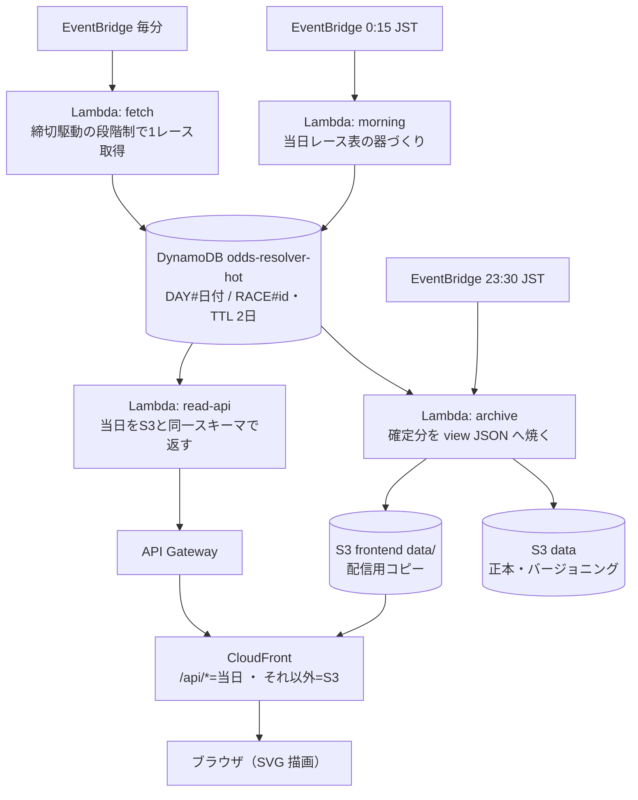

# OddsResolver

競馬オッズを「数字の羅列」から「動きと歪みの地図」へ解きほぐす可視化サイト。

**サイト**: https://dpfh12i0smzxl.cloudfront.net/ （地方競馬の実データで自動運用中）

オッズをそのまま並べるのではなく、**時間 × 馬 × 濃淡**でオッズがどう動いたかを一目で読ませる。
"顔" は**馬 × 時間の支持率ヒートマップ**（縦=馬、横=時刻、色=支持率）。

> "resolve" = ごちゃついた数字を、意味のある視覚像に解きほぐす。

## アーキテクチャ（稼働中 / AWS 無料枠）

詳細はそれぞれの持ち場に置く: リソース定義とジョブの時刻・順序は
[hakusoft-infra/odds-resolver](https://github.com/hakusoft/hakusoft-infra/tree/main/odds-resolver)、
取得まわりの制約（Crawl-Delay 60・段階制）は `ingest/README.md`、
レース ID 体系は `docs/race-id.md`。

## データ配置と配信

| パス | 内容 | キャッシュ |
| --- | --- | --- |
| `data/days.json` | 開催日の目次（夜間バッチが管理） | 60 秒 |
| `data/{YYYYMMDD}/index.json` | 日別一覧 + 事前計算指標（top1 / ent） | 1 時間 |
| `data/races/{race_id}.json` | レース詳細（馬・全スナップショット） | 24 時間 |
| `api/?date=` `api/?id=` | 当日の同スキーマ JSON（DynamoDB 直読み） | 60 秒 |

フロントは「当日 = api/ 優先・過去 = data/ 優先」のフォールバックで読む。

## デプロイ（すべて main マージで自動）

| 経路 | 対象 | 備考 |
| --- | --- | --- |
| deploy.yml | `frontend/` → S3 + CloudFront 無効化 | `data/` 配下には一切触れない（夜間バッチの領分） |
| deploy-ingest.yml | `ingest/` → Lambda 4 関数 | テスト → zip 化 → update-function-code。OIDC ロールは frontend 用と分離 |
| hakusoft-infra | Terraform（器・IAM・EventBridge） | 手元 apply。Lambda のコードは ignore_changes で CI の領分 |

## 主要な設計判断とその理由

| 判断 | 理由 |
| --- | --- |
| ユーザー提示は 1 分毎 | WebSocket / 常時接続が不要になり、無料枠に素直に収まる |
| 取得は毎分 1 判断 + 段階制 | EventBridge 最短 1 分と Crawl-Delay 60 が噛み合う。切迫度で 1 レースを選ぶ |
| 過去は静的ファイルに焼く | append-only。落ちるサーバーが無く、CDN が何万アクセスでも捌く |
| アーカイブは RDS ではなく S3 | 「たまに分析」に常駐 RDBMS は過剰。必要になれば使った分だけの Athena 等を後付けできる |
| 探索用 raw/ は作らない | append-only ゆえ view から後追い生成できる。需要が出るまで夜間バッチを軽く保つ |
| 描画はブラウザ、Lambda は数字まで | サーバーで絵を作らない。見た目の変更をフロントの JS デプロイだけで完結させる |
| archive は read-api の整形を共用 | 当日 / 過去のスキーマ乖離をコードの構造で防ぐ |
| 取得は VPC 外 Lambda（送信元 IP 可変） | IP 単位のブロック / レート制限を自然に回避し、NAT Gateway の固定費を避ける |
