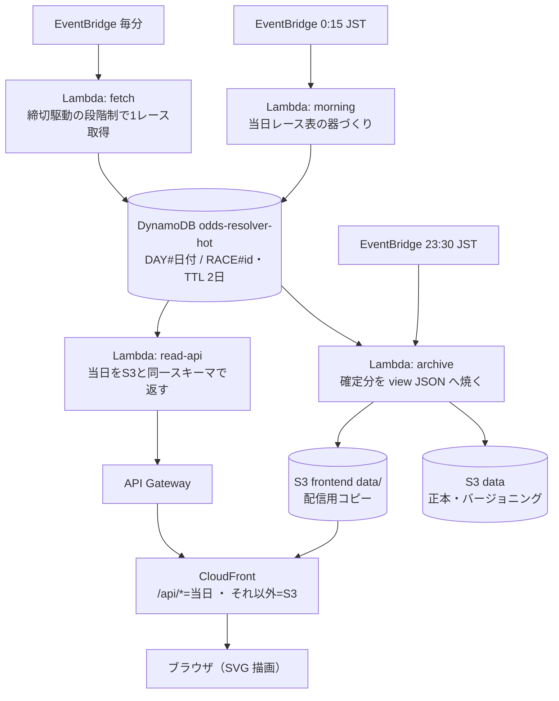

# OddsResolver

競馬オッズを「数字の羅列」から「動きと歪みの地図」へ解きほぐす可視化サイト。

**サイト**: https://dpfh12i0smzxl.cloudfront.net/ （地方競馬の実データで自動運用中）

オッズをそのまま並べるのではなく、**時間 × 馬 × 濃淡**でオッズがどう動いたかを一目で読ませる。
"顔" は**馬 × 時間の支持率ヒートマップ**（縦=馬、横=時刻、色=支持率）。

> "resolve" = ごちゃついた数字を、意味のある視覚像に解きほぐす。

## アーキテクチャ（稼働中 / AWS 無料枠）

**1 日のリズム**: 23:30 に当日分を焼く → 0:15 に翌日の器を作る → 毎分フェッチ。
この順序で、日付切替時に前日分が読めない空白を作らない。

- **単一テーブル設計**: 必要な問いを全てキー直撃にする。当日の全レース表 =
  `Query PK=DAY#{日付}`、レースの時系列 = `Query PK=RACE#{id}`、最新 = 同降順 Limit 1。
- **移送済みデータは DynamoDB の TTL（2 日）で自動失効**。削除処理は書かない。
- **当日と過去は同一スキーマ**: archive は read-api の整形関数をそのまま使って焼く。
  「同一」を約束ではなく構造で保証し、フロントは URL の差し替えだけで読み分ける。
- **レース ID はサイト独自形式** `{YYYYMMDD}-{会場スラッグ}-{RR}`（docs/race-id.md）。
  日付判別・ソート・S3 前方一致検索がこの一つで済む。

### 取得の方針

- **Crawl-Delay 60 秒（取得元 robots.txt）は絶対制約**。毎分起動の Lambda が
  1 起動 1 リクエストまでという構造で守る。過去ページの後追い取得でも同じ。
- **締切駆動の段階制**: 発走が近いレースほど短い間隔で取る
  （T-45〜20 分: 15 分毎 / T-20〜10: 5 分毎 / T-10〜発走: 2 分毎 / 発走直後: 確定 1 回）。
  数字は仮置きで、実測調整は #23。
- **VPC 外 Lambda（送信元 IP 可変）**: IP 単位のブロック / レート制限を自然に回避し、
  NAT Gateway の固定費を払わない。クラウド帯ごと拒否された場合のみ固定 IP を別途検討。
- 取得元の詳細（サイト名・URL・DOM 依存）は公開物に書かず、`ingest/` 内に閉じる。

### サーバーとブラウザの責務境界

**Lambda は「数字を作る」まで、ブラウザは「数字を絵にする」。** 描画はサーバーでは行わない。

|  | 取得 | 指標計算 | 整形 (view) | 描画 (絵) |
| --- | --- | --- | --- | --- |
| 当日 | fetch | read-api | read-api | ブラウザ |
| 夜間 | ― | archive | archive | ― |
| 過去表示 | ― | ― | (焼済み) | ブラウザ |

- **view は「指標計算まで済んだ整形 JSON」**であって、絵（SVG / HTML）ではない。
- **絵まで焼かない**理由：配色やチャートを後から変えても再生成が要らず、フロントの
  JS だけ直せばよい。絵まで焼くと、見た目を一つ変えるたび全過去レースの再焼きになる。
- 探索的分析（たまに・重いクエリ）の基盤は**持たない**。append-only ゆえ view に全事実が
  残り、需要が生まれた時点で raw/（Parquet）+ Athena 等を後追いで足せる。

## データ配置と配信

| パス | 内容 | キャッシュ |
| --- | --- | --- |
| `data/days.json` | 開催日の目次（夜間バッチが管理） | 60 秒 |
| `data/{YYYYMMDD}/index.json` | 日別一覧 + 事前計算指標（top1 / ent） | 1 時間 |
| `data/races/{race_id}.json` | レース詳細（馬・全スナップショット） | 24 時間 |
| `api/?date=` `api/?id=` | 当日の同スキーマ JSON（DynamoDB 直読み） | 60 秒 |

フロントは「当日 = api/ 優先・過去 = data/ 優先」のフォールバックで読む。

## デプロイ（すべて main マージで自動）

| 経路 | 対象 | 備考 |
| --- | --- | --- |
| deploy.yml | `frontend/` → S3 + CloudFront 無効化 | `data/` 配下には一切触れない（夜間バッチの領分） |
| deploy-ingest.yml | `ingest/` → Lambda 4 関数 | テスト → zip 化 → update-function-code。OIDC ロールは frontend 用と分離 |
| hakusoft-infra | Terraform（器・IAM・EventBridge） | 手元 apply。Lambda のコードは ignore_changes で CI の領分 |

## 主要な設計判断とその理由

| 判断 | 理由 |
| --- | --- |
| ユーザー提示は 1 分毎 | WebSocket / 常時接続が不要になり、無料枠に素直に収まる |
| 取得は毎分 1 判断 + 段階制 | EventBridge 最短 1 分と Crawl-Delay 60 が噛み合う。切迫度で 1 レースを選ぶ |
| 過去は静的ファイルに焼く | append-only。落ちるサーバーが無く、CDN が何万アクセスでも捌く |
| アーカイブは RDS ではなく S3 | 「たまに分析」に常駐 RDBMS は過剰。必要になれば使った分だけの Athena 等を後付けできる |
| 探索用 raw/ は作らない | append-only ゆえ view から後追い生成できる。需要が出るまで夜間バッチを軽く保つ |
| 描画はブラウザ、Lambda は数字まで | サーバーで絵を作らない。見た目の変更をフロントの JS デプロイだけで完結させる |
| archive は read-api の整形を共用 | 当日 / 過去のスキーマ乖離をコードの構造で防ぐ |
| 取得は VPC 外 Lambda（送信元 IP 可変） | IP 単位のブロック / レート制限を自然に回避し、NAT Gateway の固定費を避ける |

## 容量の見積り

- 1 レース ≒ 18 頭 × 60 時点（1 分粒度）× 数十バイト ≒ 圧縮後 20〜50KB。
- S3 無料枠 5GB ≒ **5 万〜25 万レース ≒ 十数年〜数十年分**。テキストのみゆえ容量はまず問題にならない。
- 容量が効くのはチャート画像を焼いたときだけ。可視化は SVG / ブラウザ描画に寄せ、画像を S3 に積まない。

## 今後の拡張

計画・構想は Issue で追跡する: 指標と可視化の拡張 #41 / 日別静的 HTML + SEO #42 /
会員・広告 #43 / リアルタイム性の短縮 #44。

## ライセンス

未定。
