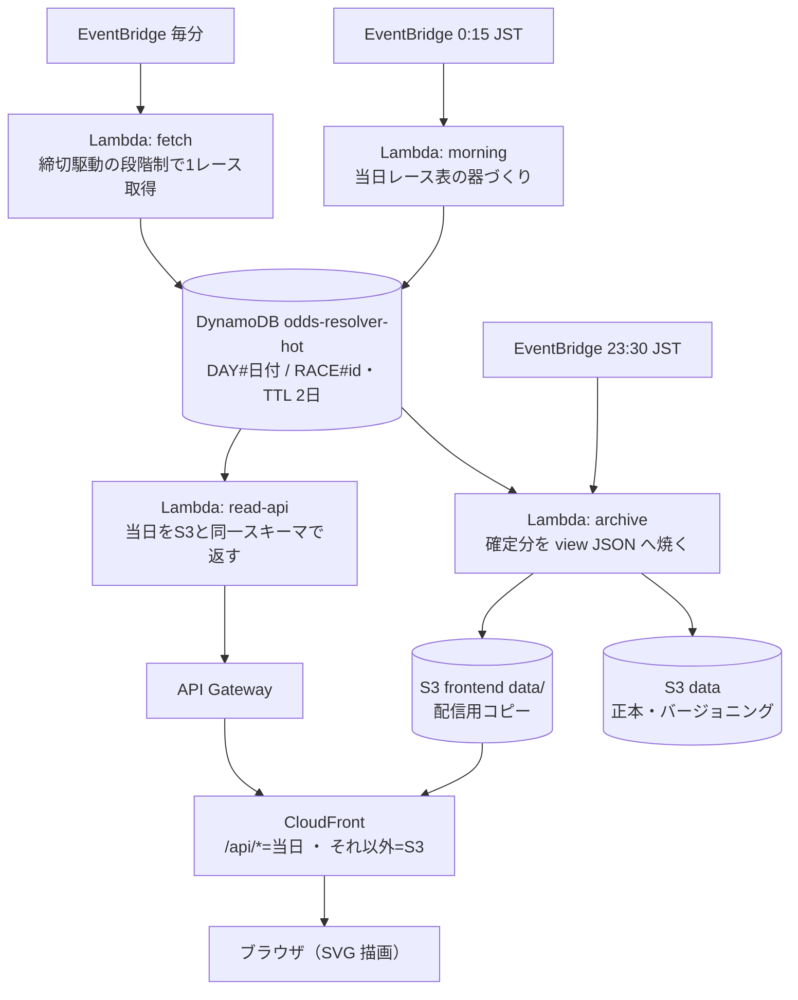

# OddsResolver

競馬オッズを「数字の羅列」から「動きと歪みの地図」へ解きほぐす可視化サイト。

**サイト**: https://dpfh12i0smzxl.cloudfront.net/ （地方競馬の実データで自動運用中）

オッズをそのまま並べるのではなく、**時間 × 馬 × 濃淡**でオッズがどう動いたかを一目で読ませる。
"顔" は**馬 × 時間の支持率ヒートマップ**（縦=馬、横=時刻、色=支持率）。

> "resolve" = ごちゃついた数字を、意味のある視覚像に解きほぐす。

## アーキテクチャ

## 1 日の動き（JST）

| 時刻 | 動くもの | すること |
| --- | --- | --- |
| 23:30 | archive | 当日の確定分を S3 へ焼く。日付が変わる**前**に昨日を確定させ、切替直後の空白を作らない |
| 0:15 | morning | 当日のレース表の器を DynamoDB に作る（0:00 ちょうどは取得元の日次切替と重なるため外す） |
| 0:16〜 | fetch | 朝の窓（発売開始 10:00 まで）に前日の着順を 1 レース/分で回収する |
| 2:30 | archive | 回収した前日の着順を S3 view へ再焼きする |
| 毎分 | fetch | 器と発走時刻を見て、最も切迫した 1 レースだけ取得する |
| 随時 | read-api | 当日データを返す。唯一のリクエスト駆動（CloudFront `/api/*` 経由） |

## 取得の理屈

- **Crawl-Delay 60 秒（取得元 robots.txt）が絶対制約**。毎分起動 × 1 起動 1 リクエスト
  という構造で守る。
- 全レース共通のスロット表（発走までの残り分 T−）を埋めていく:
  **ベースライン = T-8h〜T-1h の毎時（発売開始の 10:00 JST 以降）/
  勝負どころ = T-45, 30, 20, 15, 10, 8, 6, 4, 2 / 発走直後に確定 1 回**。
- 毎分の選択は 確定 > 勝負どころ > ベースライン の段階優先。同段では
  「スロット超過 ÷ 許容窓」が最大の 1 レース。対象がなければ何もしない。
- 取れなかったスロットは埋め戻さず**明示的な欠測**として残す。標本は全レース共通の
  「レース × スロット」行列になり、後の分析に耐える。数字は仮置きで、実測調整は #23。

---

詳細の持ち場: リソース定義と運用は
[hakusoft-infra/odds-resolver](https://github.com/hakusoft/hakusoft-infra/tree/main/odds-resolver)、
取得実装と出力データの配置は `ingest/README.md`、レース ID 体系は `docs/race-id.md`。
